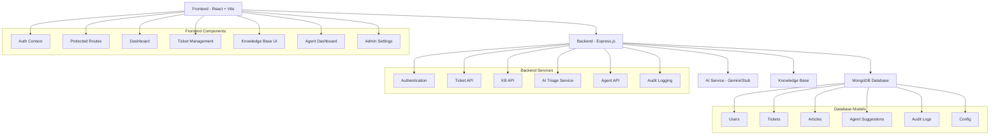

# Resolvia - Smart Helpdesk with Agentic Triage

A full-stack MERN application that provides intelligent customer support with AI-powered ticket triage, knowledge base management, and automated reply generation.

## 🏗️ Architecture Overview



## 🚀 Features

### Core Functionality

- **Multi-Role Authentication**: User, Agent, and Admin roles with JWT-based auth
- **Smart Ticket Triage**: AI-powered categorization and response suggestions
- **Knowledge Base**: CRUD operations for articles with search and categorization
- **Agent Dashboard**: Review AI suggestions, manage tickets, and track performance
- **Audit Logging**: Complete activity tracking with trace IDs
- **Responsive UI**: Mobile-first design with grayscale theme

### AI Triage Workflow

1. **Ticket Creation**: User submits a support ticket
2. **Category Prediction**: AI classifies ticket (billing, tech, shipping, other)
3. **Knowledge Retrieval**: Relevant KB articles are found using semantic search
4. **Reply Generation**: AI drafts a response citing relevant articles
5. **Confidence Scoring**: Overall confidence score (0-1) is calculated
6. **Auto-Resolution**: High-confidence tickets can be auto-closed
7. **Agent Review**: Lower confidence tickets go to human agents

### STUB_MODE vs Gemini Integration

#### STUB_MODE=true (Default)
- **Classification**: Simple keyword-based heuristics
- **Confidence**: Fixed values (0.8 for keyword matches, 0.5 otherwise)
- **Reply Generation**: Template-based responses
- **No External Dependencies**: Works offline

#### STUB_MODE=false (Gemini Integration)
- **Classification**: Google Gemini Pro for intelligent categorization
- **Reply Generation**: AI-powered responses using context
- **Fallback**: Automatically falls back to stub mode on API failures
- **Requires**: GEMINI_API_KEY environment variable

## 🛠️ Tech Stack

### Frontend
- **React 18** with TypeScript
- **Vite** for build tooling
- **React Router** for navigation
- **Tailwind CSS** for styling
- **shadcn/ui** for component library
- **Axios** for API calls
- **Context API** for state management
- **Vitest + React Testing Library** for testing

### Backend
- **Node.js 20+** with Express.js
- **MongoDB** with Mongoose ODM
- **JWT** for authentication (access + refresh tokens)
- **bcryptjs** for password hashing
- **Joi** for input validation
- **Rate limiting** for security
- **Jest** for testing

### Database Models

```typescript
// User Model
{
  name: string
  email: string (unique)
  passwordHash: string
  role: 'user' | 'agent' | 'admin'
  refreshTokens: Array<{token: string, createdAt: Date}>
  isActive: boolean
  lastLogin?: Date
}

// Ticket Model
{
  title: string
  description: string
  category: 'billing' | 'tech' | 'shipping' | 'other'
  status: 'open' | 'triaged' | 'waiting_human' | 'in_progress' | 'resolved' | 'closed'
  priority: 'low' | 'medium' | 'high' | 'urgent'
  createdBy: ObjectId
  assignee?: ObjectId
  agentSuggestionId?: ObjectId
  replies: Array<{author: ObjectId, content: string, isInternal: boolean}>
  slaDeadline?: Date
  attachmentUrl?: string
}

// Article Model (Knowledge Base)
{
  title: string
  body: string
  tags: string[]
  status: 'draft' | 'published'
  category: 'billing' | 'tech' | 'shipping' | 'other'
  createdBy: ObjectId
  viewCount: number
  helpfulCount: number
}

// AgentSuggestion Model
{
  ticketId: ObjectId (unique)
  traceId: string
  predictedCategory: string
  categoryConfidence: number
  articleIds: ObjectId[]
  draftReply: string
  confidence: number
  autoClosed: boolean
  modelInfo: {model: string, version: string, processingTime: number}
  agentFeedback?: {accepted: boolean, editedReply?: string, rating?: number}
}
```

## 📁 Project Structure

```
resolvia/
├── backend/
│   ├── models/           # Mongoose models
│   ├── routes/           # Express routes
│   ├── middleware/       # Auth, validation, error handling
│   ├── services/         # AI service, email service
│   ├── tests/           # Jest test files
│   └── server.js        # Express server setup
├── frontend/
│   ├── src/
│   │   ├── components/   # Reusable UI components
│   │   ├── pages/        # Route components
│   │   ├── contexts/     # React contexts
│   │   ├── lib/          # Utilities and API client
│   │   └── test/         # Vitest test files
│   ├── public/          # Static assets
│   └── index.html       # HTML template
└── package.json         # Root package.json with scripts
```

## 🚀 Getting Started

### Prerequisites

- Node.js 20+ and npm
- MongoDB (local or MongoDB Atlas)
- Optional: Google Gemini API key for AI features

### Installation

1. **Clone the repository**
   ```bash
   git clone <repository-url>
   cd resolvia
   ```

2. **Install dependencies**
   ```bash
   npm run install-all
   ```

3. **Set up environment variables**
   
   Backend (`backend/.env`):
   ```env
   NODE_ENV=development
   PORT=5000
   MONGODB_URI=mongodb://localhost:27017/resolvia
   JWT_SECRET=your-super-secret-jwt-key-here
   JWT_REFRESH_SECRET=your-super-secret-refresh-key-here
   JWT_EXPIRES_IN=1h
   JWT_REFRESH_EXPIRES_IN=7d
   
   # AI Configuration
   STUB_MODE=true
   GEMINI_API_KEY=your-gemini-api-key-here
   
   # Rate Limiting
   RATE_LIMIT_WINDOW_MS=900000
   RATE_LIMIT_MAX_REQUESTS=5
   ```

   Frontend (`frontend/.env`):
   ```env
   VITE_API_URL=http://localhost:5000/api
   ```

4. **Start the development servers**
   ```bash
   npm run dev
   ```

   This starts both backend (http://localhost:5000) and frontend (http://localhost:5173) concurrently.

### Database Setup

The application will automatically create indexes and default configuration on first run. For production, ensure your MongoDB instance is properly secured.

### Demo Accounts

The application includes demo accounts for testing:

- **Admin**: admin@resolvia.com / admin123
- **Agent**: agent@resolvia.com / agent123  
- **User**: user@resolvia.com / user123

*Note: These need to be created manually via the registration form*

## 🧪 Testing

### Backend Tests (Jest)

```bash
cd backend
npm test
```

Test coverage includes:
- Authentication (registration, login, profile management)
- Knowledge Base CRUD operations with role-based access
- Ticket management and assignment
- AI Triage system (classification, article retrieval, reply generation)
- Audit logging functionality

### Frontend Tests (Vitest + RTL)

```bash
cd frontend
npm test
```

Test coverage includes:
- Authentication context functionality
- Login form validation and submission
- Protected route access control with role-based permissions

### Test Database

Tests use a separate test database. Set `MONGODB_URI` to a test database URL when running tests.

## 📊 API Documentation

### Authentication Endpoints

```
POST /api/auth/register     # Register new user
POST /api/auth/login        # Login user
POST /api/auth/refresh      # Refresh access token
POST /api/auth/logout       # Logout user
GET  /api/auth/profile      # Get user profile
PUT  /api/auth/profile      # Update user profile
```

### Knowledge Base Endpoints

```
GET    /api/kb              # Search articles
GET    /api/kb/:id          # Get article by ID
POST   /api/kb              # Create article (admin)
PUT    /api/kb/:id          # Update article (admin)
DELETE /api/kb/:id          # Delete article (admin)
POST   /api/kb/:id/helpful  # Mark article as helpful
```

### Ticket Endpoints

```
GET  /api/tickets           # Get tickets (filtered by role)
POST /api/tickets           # Create new ticket
GET  /api/tickets/:id       # Get ticket details
PUT  /api/tickets/:id       # Update ticket
POST /api/tickets/:id/reply # Add reply to ticket
POST /api/tickets/:id/assign # Assign ticket to agent
```

### Agent Endpoints

```
GET  /api/agent/suggestion/:ticketId    # Get AI suggestion
POST /api/agent/suggestion/:id/feedback # Submit feedback
POST /api/agent/suggestion/:id/use      # Mark suggestion as used
GET  /api/agent/metrics                 # Get performance metrics
```

### Configuration Endpoints

```
GET   /api/config           # Get system configuration
PUT   /api/config           # Update configuration (admin)
POST  /api/config/reset     # Reset to defaults (admin)
PATCH /api/config/features  # Toggle feature flags (admin)
```

## 🔧 Configuration Options

### System Configuration (Admin Panel)

- **Auto-Close Settings**: Enable/disable automatic ticket resolution
- **Confidence Threshold**: Minimum confidence for auto-closing (0-1)
- **SLA Hours**: Default SLA deadline for new tickets
- **AI Model**: Choose between 'stub' and 'gemini-pro'
- **Business Hours**: Configure working hours and timezone
- **Rate Limits**: API rate limiting configuration

### Feature Flags

- `autoCloseEnabled`: Automatically resolve high-confidence tickets
- `emailNotificationsEnabled`: Send email notifications (stub implementation)
- `autoAssignmentEnabled`: Automatically assign tickets to agents
- `stubMode`: Use stub AI instead of Gemini API

## 🔐 Security Features

- **JWT Authentication**: Access and refresh token rotation
- **Password Hashing**: bcryptjs with salt rounds
- **Rate Limiting**: Configurable limits on auth endpoints
- **Input Validation**: Joi schemas for all API inputs
- **Role-Based Access Control**: Granular permissions for different user types
- **CORS Protection**: Restricted origins in production
- **Helmet Security**: Security headers for Express

## 🚀 Deployment

### Backend Deployment

1. Set production environment variables
2. Ensure MongoDB connection is configured
3. Set `NODE_ENV=production`
4. Configure CORS origins for your domain
5. Deploy to your preferred platform (Heroku, AWS, etc.)

### Frontend Deployment

1. Set `VITE_API_URL` to your backend URL
2. Build the application: `npm run build`
3. Deploy the `dist` folder to your static hosting service

### MongoDB Atlas Setup

1. Create a MongoDB Atlas cluster
2. Configure network access (IP whitelist)
3. Create database user with appropriate permissions
4. Update `MONGODB_URI` with Atlas connection string

## 🧠 AI Integration Guide

### Using Google Gemini

1. **Get API Key**: Obtain a Gemini API key from Google AI Studio
2. **Set Environment Variable**: `GEMINI_API_KEY=your-key-here`
3. **Disable Stub Mode**: `STUB_MODE=false`
4. **Configure Model**: Update `aiModel` in system configuration

### Customizing AI Behavior

The AI service can be extended by modifying `backend/services/aiService.js`:

- **Classification Logic**: Customize category prediction
- **Article Retrieval**: Modify search algorithms
- **Reply Templates**: Adjust response generation
- **Confidence Scoring**: Tune confidence calculations

### Monitoring AI Performance

The system tracks:
- Classification accuracy by category
- Auto-close rates and success
- Agent feedback on AI suggestions
- Processing times and token usage

## 🤝 Contributing

1. Fork the repository
2. Create a feature branch: `git checkout -b feature/amazing-feature`
3. Commit your changes: `git commit -m 'Add amazing feature'`
4. Push to the branch: `git push origin feature/amazing-feature`
5. Open a Pull Request

## 📜 License

This project is licensed under the MIT License - see the LICENSE file for details.

## 🆘 Support

For support and questions:

1. Check the documentation above
2. Review existing GitHub issues
3. Create a new issue with detailed description
4. Include logs and environment details

## 🎯 Future Enhancements

- Real email integration (SendGrid, AWS SES)
- File upload support for ticket attachments
- Advanced analytics and reporting
- Multi-language support
- Integration with external ticketing systems
- Mobile app development
- Advanced AI features (sentiment analysis, urgency detection)
- Webhook support for external integrations
